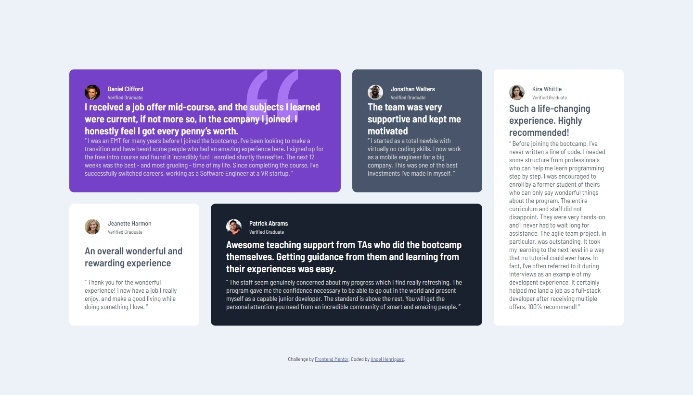

# Frontend Mentor - Testimonials grid section solution

This is a solution to the [Testimonials grid section challenge on Frontend Mentor](https://www.frontendmentor.io/challenges/testimonials-grid-section-Nnw6J7Un7). Frontend Mentor challenges help you improve your coding skills by building realistic projects. 

## Table of contents

- [Overview](#overview)
  - [The challenge](#the-challenge)
  - [Screenshot](#screenshot)
  - [Links](#links)
  - [Built with](#built-with)
  - [Continued development](#continued-development)
- [Author](#author)

**Note: Delete this note and update the table of contents based on what sections you keep.**

## Overview
Great challange to use your skills on CSS Grid.

### The challenge

Users should be able to:

- View the optimal layout for the site depending on their device's screen size

### Screenshot

### Links

- Solution URL: [Add solution URL here](https://github.com/pr0g4ng3l/testimonials-grid)
- Live Site URL: [Add live site URL here](https://pr0g4ng3l.github.io/testimonials-grid/)

### Built with

- Semantic HTML5 markup
- CSS custom properties
- CSS Grid

### Continued development

- CSS Grid
- Javascript

## Author

- Website - [Angel Henriquez](https://github.com/pr0g4ng3l)
- Frontend Mentor - [@pr0g4ng3l](https://www.frontendmentor.io/profile/pr0g4ng3l)
- Twitter - [@navimmii](https://twitter.com/navimmii)
- Linkedin - [Angel Ivan Henriquez Martinez](https://www.linkedin.com/in/angel-ivan-henr%C3%ADquez-mart%C3%ADnez-16a6b6218/)